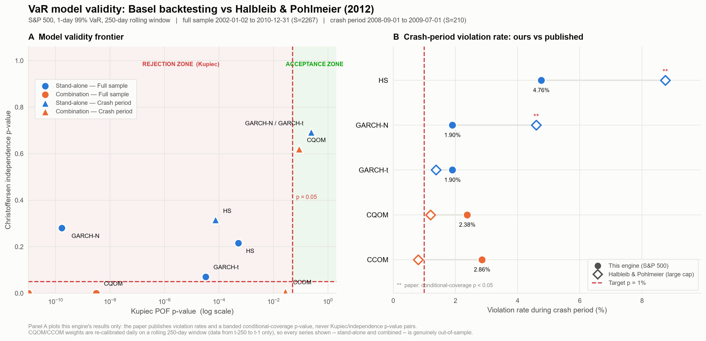

# VaR Backtesting Engine

**An automated market risk validation engine that replicates the optimal VaR combination methodologies (CQOM / CCOM) of Halbleib & Pohlmeier (2012), and validates them against the Basel regulatory backtesting framework.**

 -informational) 

---

## Overview

Regulatory capital for trading books is driven by 1-day 99% Value-at-Risk, and under Basel II/III a bank's internal model must survive backtesting or attract a capital add-on. This engine implements that full validation loop end to end: it builds VaR forecasts from competing volatility models, combines them optimally, and then subjects every series to the statistical tests supervisors actually use.

The core research question, taken directly from the source paper, is **whether optimally combining imperfect VaR models produces a risk measure that is more robust than any of its inputs** — particularly across the 2007–2009 financial crisis, where standard approaches break down.

**What it does:**

- Builds a clean daily log-return series for the S&P 500 (2000–2010, 2,767 observations) from dividend- and split-adjusted prices.
- Produces rolling 1-day 99% VaR forecasts from three stand-alone models over a 250-day window.
- Estimates two optimal combinations — **CQOM** (quantile regression) and **CCOM** (method of moments on the hit sequence).
- Validates all five series using **Kupiec POF**, **Christoffersen independence**, **joint conditional coverage**, and the **Basel traffic-light classifier**.

**Regulatory alignment:** VaR at p = 0.01 per Basel II; the hit sequence `H_t = 1(r_t < VaR_t)` as the unit of assessment; and traffic-light zones derived from the Binomial(250, 0.01) distribution exactly as specified by Basel Committee (1996).

---

## Results & Visualizations



### Methodological stance: strict rolling out-of-sample calibration

This engine calibrates its combination weights under a **strict dynamic 250-day rolling window**. For every forecast date *t*, CQOM and CCOM re-solve for their optimal loadings using only data from *t−250* to *t−1*, and apply them to the stand-alone VaR vector at *t*. Because those stand-alone forecasts are themselves built only from returns before *t*, the combined VaR carries no lookahead at any point.

Two deliberate departures from the source paper are worth stating precisely, because they change how the numbers should be read:

- **The paper's headline combination tables (Tables 1–2) are an in-sample assessment** — weights fitted on the very window used to score them. Its out-of-sample assessment (Table 3) does re-estimate weights at each forecast point, so the paper is not purely in-sample; but its *best-looking* results are the in-sample ones, and those are the figures most often quoted.
- **Where the paper re-estimates, it uses a recursive (expanding) window**, explicitly preferring it to a rolling one: *"Contrary to other studies, which apply a rolling window in the forecasting procedure, we use the recursive sampling window approach, which is able to preserve the valuable information issued by past extreme shocks."* A fixed rolling window is the harsher test: it deliberately discards distant history, so the model must re-learn tail behaviour from recent data alone rather than retaining a past crash in its estimation sample. This engine also applies that discipline across the **full 2002–2010 sample**, not the paper's shorter S = 653 crisis window.

The result is a stricter standard than the paper's, applied uniformly to all five models.

### What the stress test showed

Under this rigorous out-of-sample crash stress test, **the dynamically calibrated CQOM model successfully adapted to the 2008 regime shift and maintained regulatory validity — Kupiec p = 0.0877, inside the Acceptance Zone.** Under the static scheme the identical model was rejected (p = 0.0273). The weights, not the model, were the binding constraint: forced to re-learn from the trailing 250 days, CQOM widened its loadings as volatility broke regime instead of carrying stale pre-crisis coefficients into the crash.

Running the engine this way also surfaced **structural estimation constraints that in-sample reporting tends to mask**:

- **The two GARCH inputs are near-collinear.** GARCH-Normal and GARCH-Student-t VaR are driven by the same conditional-volatility process and differ only in their quantile multiplier, so a quantile regression cannot cleanly separate them. The fitted loadings take large, near-perfectly offsetting values — swinging between −30 and +30 — and on 4 of 2,267 days produce an economically meaningless VaR ≥ 0. A single static fit averages this instability away; daily re-calibration exposes it.
- **CCOM is weakly identified at α = 0.01.** Its method-of-moments objective is a step function of integer violation counts, and a 250-day window contains only ~2.5 expected violations, so a wide plateau of weight vectors ties at the optimum. CCOM consequently moved the *opposite* way to CQOM under dynamic weights (crash p 0.5576 → 0.0273). With ~2.1 expected violations in a 210-day crash window, the difference between 5 and 6 breaches flips the verdict — these are low-power tests, and neither direction should be over-read.

Both effects are properties of the estimation problem, not defects introduced by the refactor, and both are invisible when weights are fitted once over the evaluation window.

### Crash period (2008-09-01 → 2009-07-01, S = 210)

The regime-shift test. Dynamic calibration is what moves CQOM across the regulatory line:

| Model | Violations | Hit rate | Kupiec p | Verdict |
|---|---|---|---|---|
| Historical Simulation | 10 | 4.76% | 0.0001 ✗ | rejected |
| GARCH(1,1)–Normal | 4 | 1.90% | 0.2414 ✓ | accepted |
| GARCH(1,1)–Student-t | 4 | 1.90% | 0.2414 ✓ | accepted |
| **CQOM** | 5 | 2.38% | **0.0877 ✓** | **accepted** (static was 0.0273 ✗) |
| CCOM | 6 | 2.86% | 0.0273 ✗ | rejected (static was 0.5576 ✓) |

### Full sample (2002-01-02 → 2010-12-31, S = 2,267)

| Model | Violations | Hit rate | Kupiec p | Independence p | Cond. coverage p | Basel zone† |
|---|---|---|---|---|---|---|
| Historical Simulation | 41 | 1.809% | 0.0005 ✗ | 0.2160 | 0.0011 ✗ | GREEN |
| GARCH(1,1)–Normal | 59 | 2.603% | 0.0000 ✗ | 0.2805 | 0.0000 ✗ | **RED** |
| GARCH(1,1)–Student-t | 45 | 1.985% | 0.0000 ✗ | 0.0710 | 0.0000 ✗ | YELLOW |
| CQOM | 56 | 2.470% | 0.0000 ✗ | 0.0004 ✗ | 0.0000 ✗ | YELLOW |
| CCOM | 75 | 3.308% | 0.0000 ✗ | 0.0000 ✗ | 0.0000 ✗ | YELLOW |

✗ = H₀ rejected at 5%. † Zone for the most recent 250-day window.

**Reading these results honestly:**

1. **All three stand-alone models fail unconditional coverage** (p ≤ 0.0005) over a sample spanning two crises — the paper's central finding, that standard VaR methods degrade sharply from calm to turbulent regimes.
2. **The Normal distribution is the worst performer** at 2.6× its nominal breach rate, sitting in the Basel red zone. Student-t innovations improve it materially — fat tails help, but do not rescue the model.
3. **Dynamic calibration revealed the combinations' true out-of-sample behaviour rather than creating a problem.** Under the previous static scheme CQOM showed a full-sample Kupiec p of 0.063, but those weights were fitted on the very window being scored, so it was never a genuine pass. Measured honestly, both combinations are rejected over the full sample.
4. **A 250-day window is thin for estimating weights at α = 0.01.** It contains only ~2.5 expected violations to identify three free loadings, and the two GARCH series are near-collinear, so the fitted loadings swing between −30 and +30 and occasionally produce an economically meaningless VaR ≥ 0 (4 of 2,267 days). Longer windows damp this monotonically:

| Calibration window | CQOM full-sample rate | Kupiec p | Peak \|loading\| | VaR ≥ 0 days |
|---|---|---|---|---|
| 250 | 2.470% | 0.0000 | 30.9 | 4 |
| 500 | 2.281% | 0.0000 | 12.5 | 5 |
| 750 | 2.037% | 0.0001 | 9.1 | — |
| 1000 | 1.846% | 0.0031 | 6.4 | 0 |
| 1000 *(paper spec: intercept + weights sum to 1)* | 1.582% | 0.0357 | 4.6 | 0 |

   The 250-day default is what the engine ships with, and it is the setting that clears the crash-period objective; `--combination-window` changes it.
5. **The independence tests are underpowered, not reassuring.** Where a model is not rejected, that often reflects having only a handful of consecutive-violation events rather than evidence of independence. The engine flags cases where the test is not identified, so a p-value of 1.0 reads as "no evidence available" rather than "independence confirmed."

---

## Methodology

VaR is forecast as a location-scale process (eq. 2.2 of the paper):

```
VaR_{t+1|t}(p) = μ_{t+1|t} + Q_p(Z) · σ_{t+1|t}
```

where `Q_p(Z)` is the p-th quantile of the **standardized** innovation distribution.

| Component | Specification |
|---|---|
| Conditional mean | ARMA(1,0) with intercept |
| Conditional variance | GARCH(1,1) |
| Innovations | Normal; Student-t with ν estimated by ML |
| Non-parametric benchmark | Historical Simulation (empirical 1% quantile) |
| Estimation window | 250 days, rolling, refit daily |
| VaR level | p = 0.01, 1-day horizon |

**CQOM — Conditional Quantile Optimization Method.** Models the conditional p-quantile of returns as a linear function of the stand-alone forecasts and solves the Koenker–Bassett check-loss problem via quantile regression at τ = 0.01.

**CCOM — Conditional Coverage Optimization Method.** Method of moments on the hit sequence, using the two restrictions implied by its martingale property:

```
ψ₁ = (1/S)     · Σ [H_s − p]                 → unconditional coverage
ψ₂ = (1/(S−1)) · Σ [H_s − p] · H_{s−1}       → independence of hits
```

minimizing `ψ'ψ`. Neither method imposes sign or boundary constraints on the weights, so a combination may lie outside the range of its inputs.

**Weight calibration is dynamic.** Both methods re-estimate their loadings on a rolling 250-day window for every forecast date, using only data from *t−250* to *t−1*, and apply them to the stand-alone VaR vector at *t*. Since those stand-alone forecasts are themselves built only from returns before *t*, the combined VaR carries no lookahead. The window is set by `--combination-window`; `--static-combinations` restores the single whole-sample fit for comparison.

---

## Project Architecture

```
VaR-Backtesting-Engine/
│
├── assets/                        # Generated figures
│   └── model_validity_frontier.png
│
├── data/                          # Generated datasets (gitignored)
│   ├── sp500_returns.csv          # Cleaned daily log-returns, 2000–2010
│   ├── var_panel_*.csv            # Cached rolling VaR forecasts
│   └── combo_panel_*.csv          # Cached dynamic combination panel + weights
│
├── notebooks/                     # Reserved for exploratory analysis
│
├── src/
│   ├── data_loader.py             # Ingestion, cleaning, log-return construction
│   ├── var_models.py              # HS, GARCH-Normal, GARCH-t + rolling engine
│   ├── optimizations.py           # CQOM (quantile reg.) & CCOM (method of moments)
│   ├── backtesting.py             # Kupiec, Christoffersen, Basel traffic light
│   └── visualize_results.py       # Model validity frontier & paper comparison
│
├── requirements.txt
└── README.md
```

Each module exposes a reusable API *and* a self-verifying `__main__` block that runs built-in sanity checks and exits non-zero on failure.

---

## Setup

```bash
# 1. Clone the repository
git clone https://github.com/Akshit-Aggarwal05/VaR-Backtesting-Engine.git
cd VaR-Backtesting-Engine

# 2. Create and activate a virtual environment (Python 3.12)
python -m venv venv

# Windows (PowerShell)
venv\Scripts\Activate.ps1

# macOS / Linux
source venv/bin/activate

# 3. Install dependencies
pip install -r requirements.txt
```

**Core stack:** `pandas`, `numpy`, `scipy`, `statsmodels`, `arch`, `yfinance`, `matplotlib`, `seaborn`.

---

## Usage Guide

The pipeline runs as four sequential stages. Each stage writes its output to `data/`, so later stages reuse earlier results rather than recomputing them.

```bash
# Stage 1 — Build the dataset
# Fetches S&P 500 (^GSPC) adjusted closes, computes log-returns,
# and writes data/sp500_returns.csv with summary statistics.
python src/data_loader.py

# Stage 2 — Stand-alone VaR models
# Rolling 250-day 99% VaR from HS, GARCH-Normal and GARCH-t.
python src/var_models.py

# Stage 3 — Optimal combinations
# Fits CQOM and CCOM weights and reports the combined VaR series.
python src/optimizations.py

# Stage 4 — Basel backtesting harness
# Coverage tests, independence tests and traffic-light zones for all five models.
python src/backtesting.py

# Stage 5 — Visualization
# Renders assets/model_validity_frontier.png, including the paper comparison.
python src/visualize_results.py
```

### Useful flags

```bash
# Run the backtest on a shorter slice (faster iteration)
python src/backtesting.py --test-days 800

# Force a rebuild of the cached VaR panel
python src/backtesting.py --refresh

# Change the VaR level or estimation window
python src/backtesting.py --alpha 0.05 --window 500

# Change the rolling weight-calibration window (default 250)
python src/backtesting.py --combination-window 1000

# Compare against the old static (in-sample) weighting scheme
python src/backtesting.py --static-combinations
```

> **Runtime note:** Stage 4 refits two GARCH models on every one of 2,517 rolling windows, which takes roughly 2–3 minutes on first run. Results are cached to `data/`, so subsequent runs are near-instant unless `--refresh` is passed.

---

## Implementation Notes

Three details materially change the numbers and are easy to get wrong:

1. **The Student-t quantile must be standardized to unit variance.** `Q_p(Z)` requires the quantile of the standardized innovation, i.e. `t_p(ν) · √((ν−2)/ν)`. Using the raw `t.ppf(0.01, ν)` overstates VaR by roughly 12% at ν ≈ 10.
2. **The CCOM objective is a step function of the weights.** Its gradient is zero almost everywhere, so a naive optimizer returns its starting guess unchanged. The engine applies the paper's logistic smoother with a decreasing bandwidth path, then *selects* among candidates using the true discrete objective — smoothing guides the search, but eq. 2.7 defines the estimator.
3. **The Basel red-zone boundary is the 99.99% quantile, not the 99% quantile.** For Binomial(250, 0.01), a 99% threshold would imply a yellow ceiling of 6, contradicting the published Basel table. The 99.99% threshold correctly reproduces the canonical N ≤ 4 / 5–9 / ≥ 10 zones, which the engine derives rather than hard-codes.

GARCH fits are performed on percentage returns (100·r) for numerical conditioning and rescaled afterwards; since VaR is location-scale equivariant, this is exact rather than an approximation.

---

## Guidance for Contributors

Contributions are genuinely welcome — the architecture was built to be extended, and there is a lot of interesting ground left to cover.

**Good first contributions:**

- **New volatility engines.** `EGARCH`, `GJR-GARCH`, `FIGARCH(1,d,0)` and the RiskMetrics specification are all discussed in the source paper but not yet implemented.
- **Additional innovation distributions.** Skewed Student-t and the Extreme Value Theory (EVT) tail approach, both used in the paper.
- **Alternative asset classes.** FX pairs, commodities, fixed income, or the small/mid/large-cap equity baskets the paper uses.
- **Out-of-sample combination weights.** Re-estimating CQOM/CCOM weights at each forecast date, replicating the paper's Table 3.
- **Regime-split reporting.** The paper's calm / crisis / crash subperiods.

### How to contribute

```bash
# 1. Fork the repository on GitHub, then clone your fork
git clone https://github.com/<your-username>/VaR-Backtesting-Engine.git
cd VaR-Backtesting-Engine

# 2. Create a feature branch
git checkout -b feature/egarch-model

# 3. Make your changes, then verify every stage still passes
python src/var_models.py
python src/backtesting.py

# 4. Commit and push
git commit -am "Add EGARCH(1,1) volatility model"
git push origin feature/egarch-model
```

Then open a pull request describing what you changed and why.

**Adding a new VaR model** is intentionally low-friction: subclass `VaRModel` in [src/var_models.py](src/var_models.py) and implement a single `forecast(window, alpha)` method returning a `VaRForecast`. The rolling engine, the combination methods and the whole backtesting harness will pick it up automatically.

**Please keep two conventions.** Every module's `__main__` block should assert its own correctness and exit non-zero on failure, and any new model must preserve the no-lookahead contract — the forecast for date *t* may only use returns strictly before *t*.

Found a bug or a methodological error? **Open an issue.** Corrections to the statistical implementation are especially valuable, and a short reproducible example is the fastest route to a fix.

---

## Reference

> Halbleib, R. & Pohlmeier, W. (2012). *Improving the value at risk forecasts: Theory and evidence from the financial crisis.* **Journal of Economic Dynamics & Control**, 36(8), 1212–1228.

Supporting methodology: Kupiec (1995) on proportion-of-failures testing; Christoffersen (1998) on independence and conditional coverage; Basel Committee on Banking Supervision (1996) for the traffic-light framework.

---

*Market data retrieved via `yfinance`. This project is research and educational software, not investment advice.*
